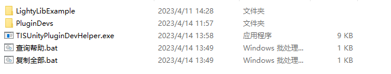

# TISUnityPluginDevHelper
**TisGameKitDev**

## 简述

偷懒工具，目前实现方式比较粗糙，等待后续修改吧。

生成插件之后可以直接一键复制到Unity项目工程内。

需要以以下形式组织Unity工程和插件工程。

```
根目录
	Unity工程目录
	|	Assets
	|	|	Plugins（会自动创建）
	PluginDevs（必须同名）
	|	插件名
	|		src
	|			插件名
	|				bin
	|					Release
	|						netstandard2.1
	TISUnityPluginDevHelper.exe
		
```



通过bat文件运行exe文件即可。

## 参数

### help

直接显示所有命令。


### moveAll

复制所有插件到Unity工程。